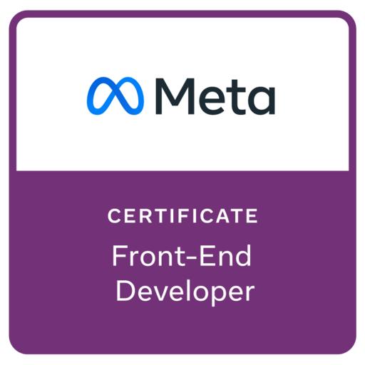

### Boas Vindas 👋

Boas vindas! Meu nome é Luiz Gustavo, sou Desenvolvedor Full Stack, formado em Engenharia da Computação e Técnico em Informática para Internet.

Tenho me dedicado a aprender cada vez mais sobre o ecossistema de tecnologia, buscando praticar minhas habilidades como desenvolvedor de software e aperfeiçoar meus conhecimentos em infraestrutura e operações.

Acredito que linguagens e ferramentas são instrumentos para atender uma necessidade, sendo necessário e importante conseguir experimentar e aprender novos conhecimentos a cada oportunidade.

### Certificações

<table>
  <tbody>
    <tr>
      <td align="center" width="33%">
        <a href="https://learn.microsoft.com/api/credentials/share/en-us/LuizGustavodaSilvaVasconcellos-1293/612E783D2FD20F8C?sharingId" target="_blank">
          
      </td>
      <td align="center" width="33%">
        
      </td>
      <td align="center" width="33%">
        
      </td>
    </tr>
  </tbody>
</table>

### Tecnologias

<!--
**iamtheluiz/iamtheluiz** is a ✨ _special_ ✨ repository because its `README.md` (this file) appears on your GitHub profile.

Here are some ideas to get you started:

- 🔭 I’m currently working on ...
- 🌱 I’m currently learning ...
- 👯 I’m looking to collaborate on ...
- 🤔 I’m looking for help with ...
- 💬 Ask me about ...
- 📫 How to reach me: ...
- 😄 Pronouns: ...
- ⚡ Fun fact: ...
-->
